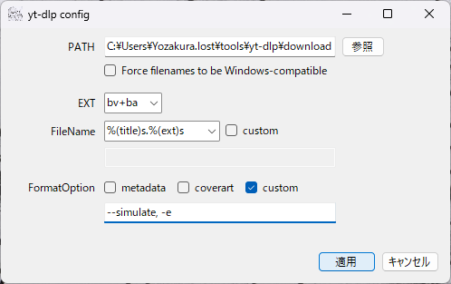
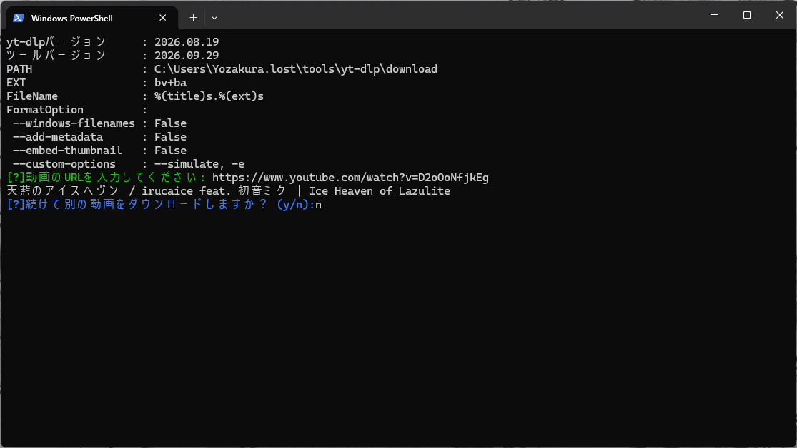

# yt-dlp config
C# .NET8.0, Windows Forms, Windows PowerShell

直感的なGUI画面`yt-dlp config.exe`でフォーマット・保存先などの設定を行い、`option.json`に保存。
<br>PowerShellスクリプト`dl.ps1` から事前に生成された`option.json`の設定を読み込み`yt-dlp`を活用した動画・音声のダウンロードを行います。
<details>
  <summary>個人製作なので、バグ修正やサポートは期待しないでくださいw</summary>
  魔理沙かわいいね
</details>

## Image



## 動作環境
- Windows 10 / 11
- .NET 8.0 Runtime
- PowerShell 7 以降 (または Windows PowerShell) [^1]
- [yt-dlp](https://github.com/yt-dlp/yt-dlp) [^2]
- [ffmpeg](https://www.ffmpeg.org/) [^2]

```ファイル構造ツリー
# 想定ファイル構造ツリー

yt-dlp config/
|- download/         # デフォルトのダウンロード保存先
|  |- etc.           # mp4/などのフォルダがダウンロード時に自動生成されます
|
|- dl.ps1            # ダウンロードスクリプト
|- option.json       # 設定保存先
|- yt-dlp config.exe # 設定管理GUI

...
yt-dlp.exe           #環境パスを通してください
...
ffmpeg.exe           #環境パスを通してください
```

## カスタム設定について
yt-dlp config.exeでは、yt-dlpでよく使用される一般的なオプション設定を保存することができます。

FileName欄のcustomチェックボックスでダウンロードファイルに自由な名前をつけることができます。
<br>※デフォルトでは同じ名前のファイルを生成すると上書きされます、多分。避けるためには`%(autonumber)s`などを使用できます。
<br>末尾には`.%(ext)s`を使用してください。ない場合、ファイル拡張子がつかなくなるかあべこべになります。

FormatOption欄のcustomチェックボックスでは、メタデータ、カバーアート埋め込み以外のほかの機能を指定することができるようになります。
<br>yt-dlpの[一般的なオプション](https://github.com/yt-dlp/yt-dlp#general-options)を参考に記入してください。区切りには`, `を使用します。
## Release
| Version | .NET | 公開日 | サポート |
----|----|----|----
| [v1.0.0](https://github.com/Yozakura-lost/yt-dlp-config/releases/tag/v.1.0.0) | 8.0 | 2026/09/29 | - |

## 著者
- デザイン　　 : `Yozakura.lost`
- コーディング : `Yozakura.lost`

## クレジット
- [yt-dlp](https://github.com/yt-dlp/yt-dlp)
- [ffmpeg](https://www.ffmpeg.org/)
- [Visual Studio 2026](https://visualstudio.microsoft.com/ja/)

## License
[MIT License](LICENSE)

## 注記
[^1]: 実行ポリシーによりブロックされる場合があります。
[^2]: 環境パスが必要です。
